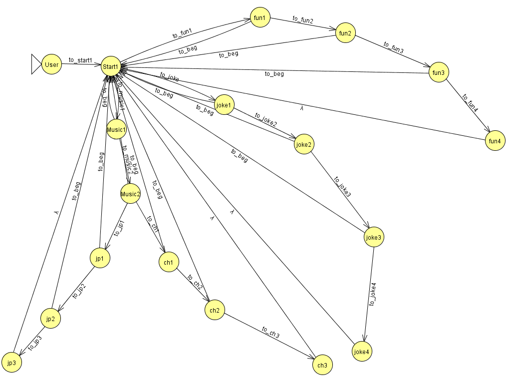

# Theory of Computation - Final Project
The facebook messenger chatbot `HappyBot` is designed to make you happy!   

## Requirement
 python 3

### 套件/模組
- bottle
- [transitions](https://github.com/tyarkoni/transitions) 
- pygraphviz

## 檔案關聯

### app.py
 - 主要執行檔案
 - 定義 FSM 的 state & transition
 - 產生 state diagram

### utils.py
 - 傳遞訊息之 function

### fsm.py
 - 定義 FSM 的動作

### Procfile
 - Heroku 執行指令
 
### Requirements & Aptfile
 - 本程式所需額外套件
 

## 機器人互動
 
### 開始
輸入訊息與機器人打招呼, 機器人會回覆你操作說明. 主要功能包含三者:

### 提供音樂
可選擇中文或日文音樂. 並會詢問是否要提供更多音樂或是歌詞.

### 提供影片
機器人提供讓你身心放鬆的有趣短片. 同樣會接續詢問是否要更多影片. 若否則返回初始狀態.

### 提供笑話
給予您歡笑的小品, 放鬆您的身心. 同樣會接續詢問是否要更多笑話. 若否則返回初始狀態.

## State Diagram
